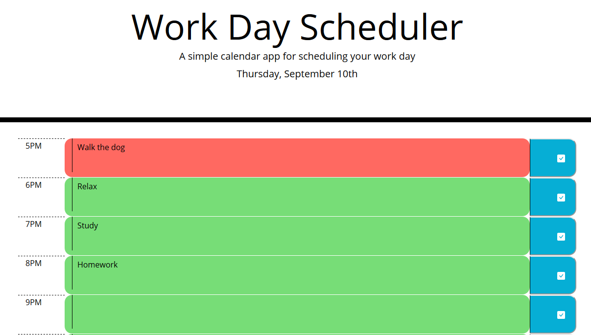

# Work Day Scheduler
Web Application for scheduling out your day. The page dynamically generates its contents based on when you first opened it, and notes for each hour of the day can be saved and will remain on the page upon refreshing after doing so. The current hour of the day will be highlighted in red, while upcoming hours are highlighted in green and hours that have past are highlighted grey. When the page is loaded on a new day, the contents of the previous page will be deleted and a new page will be created for the day.
## Deployed Application
https://bravedown.github.io/day-planner/
